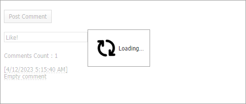

<!-- default badges list -->

[](https://supportcenter.devexpress.com/ticket/details/T228855)
[](https://docs.devexpress.com/GeneralInformation/403183)
[](#does-this-example-address-your-development-requirementsobjectives)
<!-- default badges end -->

# Loading Panel for ASP.NET Web Forms - How to implement a custom loading panel for the ASPxCallbackPanel control

This example demonstrates how to use the [ASPxLoadingPanel](https://docs.devexpress.com/AspNet/DevExpress.Web.ASPxLoadingPanel) control to implement a custom loading panel for the [ASPxCallbackPanel](https://docs.devexpress.com/AspNet/DevExpress.Web.ASPxCallbackPanel) control.



The [ASPxCallbackPanel](https://docs.devexpress.com/AspNet/DevExpress.Web.ASPxCallbackPanel) control includes a built-in loading panel. However, you can implement a custom panel in the following way:

1. Set the [SettingsLoadingPanel.Enabled](https://docs.devexpress.com/AspNet/DevExpress.Web.SettingsLoadingPanel.Enabled) property to `false` to disable the default panel.
    
    ```aspx
    <dx:ASPxCallbackPanel ID="CallbackPanel" ClientInstanceName="CallbackPanel" ...>
        <SettingsLoadingPanel Enabled="false" />
        ...
    ```
2. Use the [ASPxLoadingPanel](https://docs.devexpress.com/AspNet/DevExpress.Web.ASPxLoadingPanel) control to implement a custom loading panel.

    ```aspx
    <dx:ASPxLoadingPanel ID="LoadingPanel" ClientInstanceName="LoadingPanel" runat="server"
        Modal="true" HorizontalAlign="Center" VerticalAlign="Middle">
        <Image Url="Images/load.gif" Height="50px" Width="50px"></Image>
    </dx:ASPxLoadingPanel>
    ```

3. Handle the callback panel's [BeginCallback](https://docs.devexpress.com/AspNet/js-ASPxClientCallbackPanel.BeginCallback) and [EndCallback](https://docs.devexpress.com/AspNet/js-ASPxClientCallbackPanel.EndCallback) events to show and hide the custom loading panel, respectively.

    ```aspx
    <dx:ASPxCallbackPanel ID="CallbackPanel" ClientInstanceName="CallbackPanel" ...>
        <ClientSideEvents BeginCallback="OnBeginCallback" EndCallback="OnEndCallback" />
        ...
    ```
    ```js
    function OnBeginCallback(s, e) {
        LoadingPanel.Show();
    };
    function OnEndCallback(s, e) {
        LoadingPanel.Hide();
    };
    ```

Additionally, this example demonstrates how to add, modify, and hide controls in the `ASPxCallbackPanel` control in the [Callback](https://docs.devexpress.com/AspNet/DevExpress.Web.ASPxCallbackPanel.Callback) event handler.

## Files to Review

* [Default.aspx](./CS/Default.aspx) (VB: [Default.aspx](./VB/Default.aspx))
* [Default.aspx.cs](./CS/Default.aspx.cs) (VB: [Default.aspx.vb](./VB/Default.aspx.vb))
<!-- feedback -->
## Does this example address your development requirements/objectives?

[](https://www.devexpress.com/support/examples/survey.xml?utm_source=github&utm_campaign=asp-net-web-forms-custom-loading-panel&~~~was_helpful=yes) [](https://www.devexpress.com/support/examples/survey.xml?utm_source=github&utm_campaign=asp-net-web-forms-custom-loading-panel&~~~was_helpful=no)

(you will be redirected to DevExpress.com to submit your response)
<!-- feedback end -->
